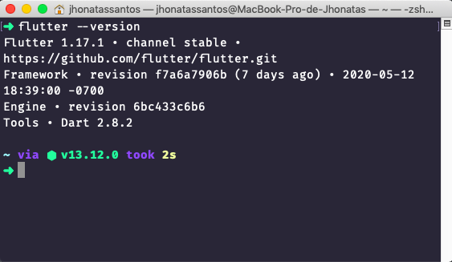
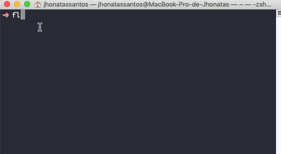

# Go QA - Seu quiz de qualidade

Um quiz simples com perguntas sobre qualidade e testes de software,
utilizado para estudo de testes com dart e flutter dentro da [Go.K ](https://gok.digital/) :green_heart:

# Configurando o ambiente

## Pré-requisito

- **Android Studio**: Segundo a própria documentação oficial do Flutter, 
ele depende de uma instalação completa do Android Studio para fornecer suas dependências 
da plataforma Android. No entanto, você pode escrever seus aplicativos 
Flutter em vários editores como por exemplo o Visual Studio CODE do qual falaremos mais adiante.

## Instalações

### **Instalando o Android Studio**

Faça o download do pacote de instalação oficial em: 
https://developer.android.com/studio/?hl=pt-pt

### **Instalando o Flutter**

Para instalar o flutter vamos ao site oficial da ferramento no link:
https://flutter.dev/docs/get-started/install

## **Configurando as variáveis de ambiente**

### **No macOS**
Acesse o arquivo *.bash_profile*, *.bashrc* ou *.zshrc* e adicione as seguintes linhas ao seu path:

export PATH=$PATH:/Users/<seunome>/devlopment/flutter/bin

export PATH=$PATH:/Users/<seunome>/devlopment/flutter/bin/cache/dart-sdk/bin

Feche o arquivo, abra o terminal e execute o comando *flutter --version*, a saida deve ser algo como:

Agora, execute o *flutter-doctor* :

*O **flutter doctor** é o comando responsável por verificar se existem dependências do Flutter 
a serem instaladas. Além disso, ele retorna um relatório sobre o status da instalação 
contendo as dependências que faltam, como instalá-las, 
problemas encontrados e como resolvê-los.*

