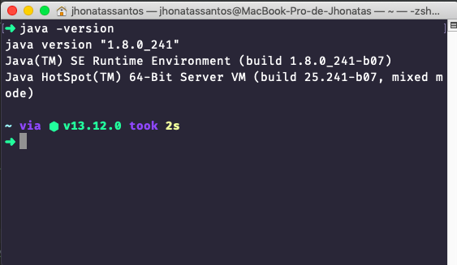
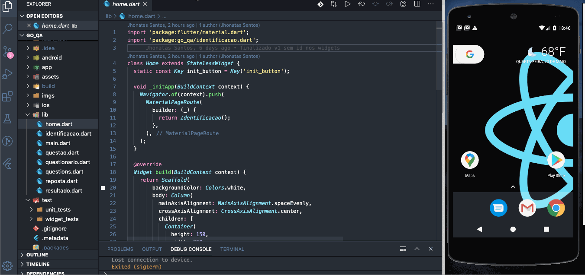

# Go QA - Seu quiz de qualidade

Um quiz simples com perguntas sobre qualidade e testes de software,
utilizado para estudo de testes com dart e flutter dentro da [Go.K ](https://gok.digital/) :green_heart:

# Configurando o ambiente

## Pré-requisito

- **Java**: Java é o ambiente computacional, ou plataforma, criada pela empresa estadunidense Sun Microsystems, 
e vendida para a Oracle depois de alguns anos. 


- **Android Studio**: Segundo a própria documentação oficial do Flutter, 
ele depende de uma instalação completa do Android Studio para fornecer suas dependências 
da plataforma Android. No entanto, você pode escrever seus aplicativos 
Flutter em vários editores como por exemplo o Visual Studio CODE do qual falaremos mais adiante.

## Instalações

### **Instalando o Java**
Acessando o site oficial podemos baixar o java, recomendo a versão 8: 
https://www.oracle.com/java/technologies/


### **Instalando o Android Studio**

Faça o download do pacote de instalação oficial em: 
https://developer.android.com/studio/?hl=pt-pt


### **Instalando o Visual Studio Code(opcional)**

Para instalar o vscode vamos ao site oficial da ferramenta no link:
https://code.visualstudio.com/


### **Instalando o Flutter**

Para instalar o flutter vamos ao site oficial da ferramenta no link:
https://flutter.dev/docs/get-started/install


## **Configurando as variáveis de ambiente**

### **No macOS**

Configurando as variáveis do Java:  
Acesse o arquivo **_.bash_profile_**, **_.bashrc_** ou **_.zshrc_** e adicione as seguintes linhas ao seu path:

export JAVA_HOME=/Library/Java/JavaVirtualMachines/jdk1.8.0_241.jdk/Contents/Home


Configurando as variáveis do Android:  
Acesse o arquivo **_.bash_profile_**, **_.bashrc_** ou **_.zshrc_** e adicione as seguintes linhas ao seu path:

export ANDROID_HOME=~/Library/Android/sdk  
export PATH=$PATH:$ANDROID_HOME/tools  
export PATH=$PATH:$ANDROID_HOME/tools/bin  
export PATH=$PATH:$ANDROID_HOME/tools/lib  
export PATH=$PATH:$ANDROID_HOME/platform-tools:$ANDROID_HOME/emulator:$PATH


Configurando as variáveis do flutter:  
Acesse o arquivo **_.bash_profile_**, **_.bashrc_** ou **_.zshrc_** e adicione as seguintes linhas ao seu path:

export PATH=$PATH:/Users/seunome/devlopment/flutter/bin  
export PATH=$PATH:/Users/seunome/devlopment/flutter/bin/cache/dart-sdk/bin


Feche o arquivo, abra o terminal e execute o comando **_java -version_**, a saida deve ser algo como:  

  

Logo em seguida, execute o comando **_flutter --version_**, a saida deve ser algo como:


Agora, execute o **_flutter-doctor_** :


>O **_flutter doctor_** é o comando responsável por verificar se existem dependências do Flutter 
a serem instaladas. Além disso, ele retorna um relatório sobre o status da instalação 
contendo as dependências que faltam, como instalá-las, 
problemas encontrados e como resolvê-los.


# Executando o projeto

## Fazendo o clone  
Abra o terminal e no diretório de sua preferência execute o comando:  

```git
git clone https://github.com/jhowsantos/go-qa.git
````
  

## Executando o projeto  
Abra o projeto no vscode ou no seu editor de preferência e na pasta raiz rode o comando:  

```flutter
flutter pub get
````

### Para android
No vscode acesse a opção Run > Run Without Debugging > selecione o device android de sua preferência  
*obs: se houver emulador aberto o app será iniciado neste*  

  

### Para iOS  
No vscode acesse a opção Run > Run Without Debugging > selecione o device iOS de sua preferência   
*obs: se houver simulador aberto o app será iniciado neste*    


# Testes no Flutter
[Vamos falar de testes ?](https://github.com/jhowsantos/go-qa/blob/bdd_with_flutter/TESTS.md)