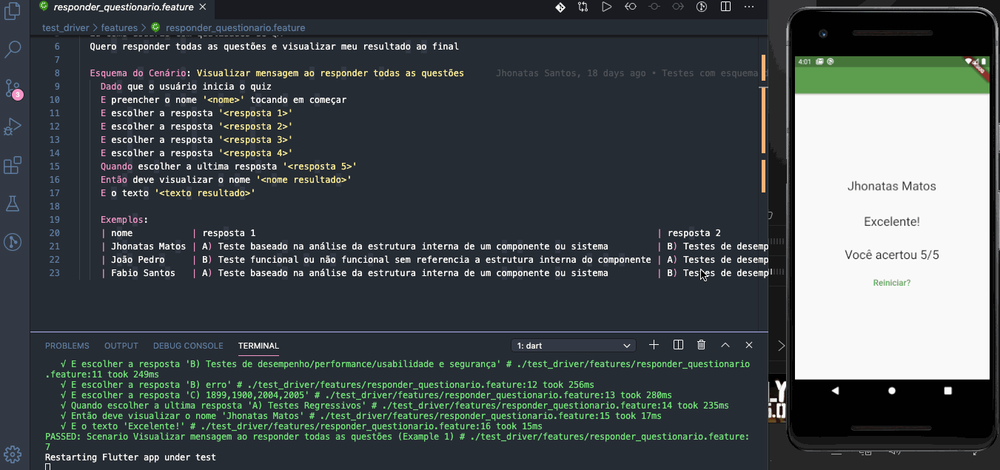

## Executando os testes

### Testes unitários  
No vscode acesse o diretório **_tests/unit_testes/_** e abra o arquivo **_pontuacao_test.dart_**  
Em cada método tem o comando *Run* e *Debug*  

Click em **_Run_** no teste específico para executar um único teste ou no main para rodar todos os testes

  

E a saida deve ser algo como:  

 

### Testes de Widget  
No vscode acesse o diretório **_tests/widget_tests/_** e abra o arquivo  
E semelhante aos testes unitários cada método tem o comando *Run* e *Debug*, para executar seguimos o mesmo passo a passo  

### Testes e2e  
No flutter temos a opção de utilizar o **_flutter_driver_** e assim como em outras linguagens conseguimos utilizar o Gherkin(**_flutter_gherkin_**) em conjunto para escrever nossos cenários de teste.
Para executar os testes com o **_flutter_driver_** basta executar o comando **_dart test_driver/bdd_test.dart_** 

